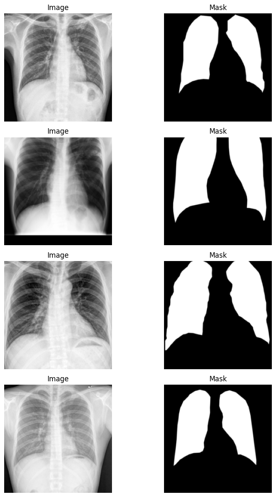
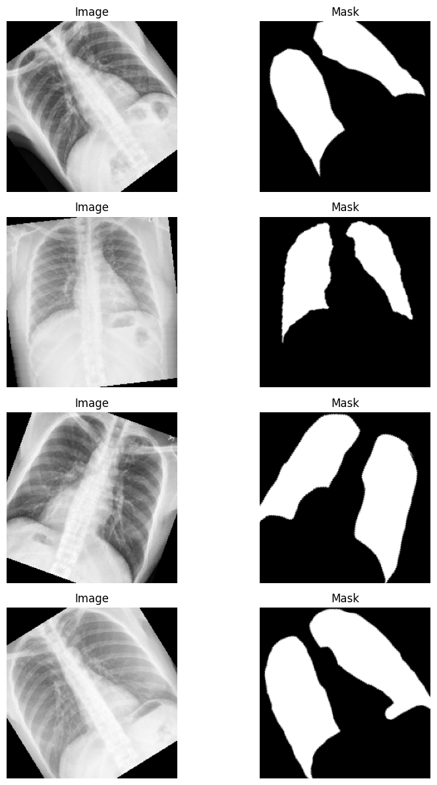
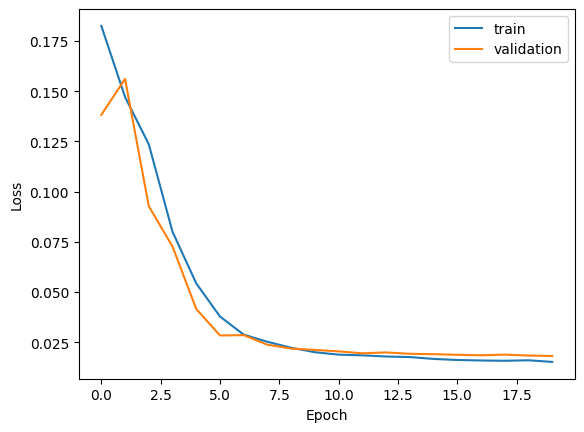
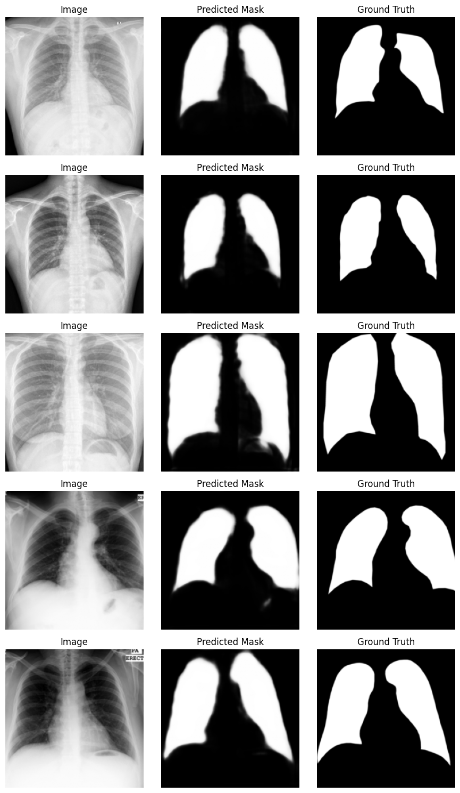
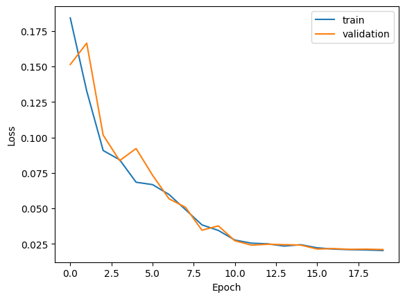
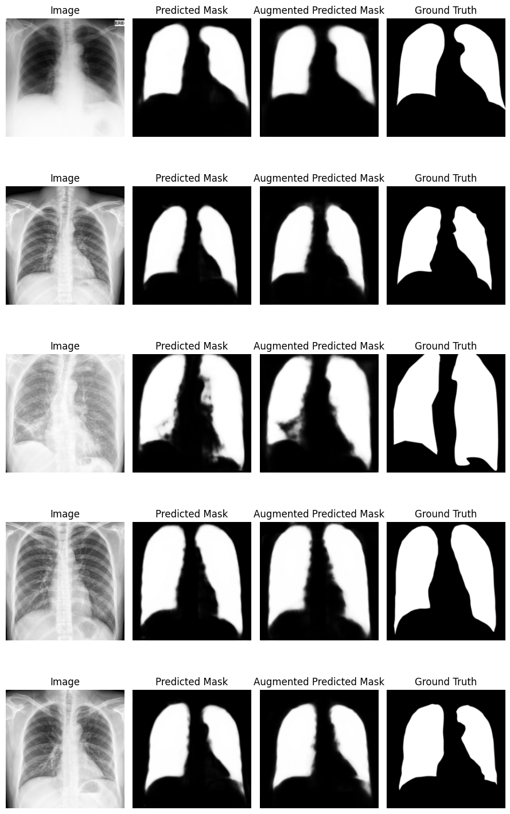

Import libraries


```python
import os
import numpy as np
import PIL
import torch
from torch import nn
from torch.utils.data import Dataset, DataLoader ,random_split
import torchvision
from torchvision.transforms import v2
import cv2
from PIL import Image, ImageFile
import matplotlib.pyplot as plt
```

Conect to google drive to have access to dataset


```python
from google.colab import drive
drive.mount('/content/drive')
```

    Mounted at /content/drive
    

# Data Preprocessing

The path of the dataset images and masks is specified.


```python
train_root = "/content/drive/MyDrive/Lung Segmentation/CXR_png_resized"
mask_root = "/content/drive/MyDrive/Lung Segmentation/masks_resized"
```

By examining the dataset, it was understood that the dataset consists of images starting with MCUCXR or CHNCXR. The images starting with MCUCXR had their masks having the same file name as themselves, while the images with CHNCXR in the beginning had _mask at the end of their masks. So, first the name of the file was checked to see if it starts with 'C', in which case a split('.')[0] was performed on the file name with _mask.png being added to it to find the mask. If the file didn't start with 'C', there was no need for splitting and adding. Then, the image path and file paths were added to the respective list variables. No transformation is allowed in this dataset to have the ability to perform augmentation better later on.


```python
class Xray_dataset(Dataset):
  def __init__(self, img_root, mask_root):
    self.img_root = img_root
    self.mask_root = mask_root

    self.img_paths = []
    self.mask_paths = []

    for img in os.listdir(self.img_root):
      if img[0].lower() == "c":
        if img.split('.')[0] + "_mask.png" in os.listdir(self.mask_root):
          self.img_paths.append(os.path.join(self.img_root, img))
          self.mask_paths.append(os.path.join(self.mask_root, img.split('.')[0] + "_mask.png"))
      else:
        if img in os.listdir(self.mask_root):
          self.img_paths.append(os.path.join(self.img_root, img))
          self.mask_paths.append(os.path.join(self.mask_root, img))

  def __len__(self):
      return len(self.img_paths)

  def __getitem__(self, idx):
      img_path = self.img_paths[idx]
      mask_path = self.mask_paths[idx]

      image = PIL.Image.open(img_path)
      mask = PIL.Image.open(mask_path)

      return image, mask
```

The Transformation class was defined to have the ability to apply transformations to the dataset. It inputs the dataset and the wanted transformation and applies it to the image and mask and returns them. As the image and mask should stay the same in respect to each other, the same transform is applied to both of them at once.


```python
class Transformation(torch.utils.data.Dataset):
    def __init__(self, dataset, transform=None):
        self.dataset = dataset
        self.transform = transform

    def __len__(self):
        return len(self.dataset)

    def __getitem__(self, index):
        image, mask = self.dataset[index]
        if self.transform:
            image, mask = self.transform(image, mask)
        return image, mask
```

Two transforms were defined: one without augmentation and one with augmentation. The image and mask were resized and center-cropped to 224, and random flip and rotation were applied as augmentation.


```python
transform = v2.Compose([v2.Grayscale(num_output_channels=1),
                        v2.Resize(256),
                        v2.CenterCrop(224),
                        v2.ToImage(),
                        v2.ToDtype(torch.float32, scale=True)])

transform_augment = v2.Compose([v2.Grayscale(num_output_channels=1),
                                v2.Resize(256),
                                v2.CenterCrop(224),
                                v2.RandomHorizontalFlip(p = 0.5),
                                v2.RandomRotation(45),
                                v2.ToImage(),
                                v2.ToDtype(torch.float32, scale=True)])
```


```python
full_dataset = Xray_dataset(train_root,mask_root)
```

The dataset was split into 80% training and 20% validation sets.


```python
train_size = int(len(full_dataset) * 0.8)
val_size = len(full_dataset) - train_size
train_set, val_set = random_split(full_dataset, [train_size, val_size])
```

Three sets were defined: one a training set without augmentation, one training set with augmentation, and one validation set without augmentation. This way, the training sets will use the same images but with and without augmentation while the validation set will be the same so that the comparison between the model with and without augmented data could be assessed better.


```python
train_dataset = Transformation(train_set, transform)
val_dataset = Transformation(val_set, transform)
train_dataset_augment = Transformation(train_set, transform_augment)
```

Batch size 16 was chosen to make sure the GPU RAM won't get overloaded.


```python
train_loader = DataLoader(train_dataset, batch_size=16, shuffle = True)
val_loader = DataLoader(val_dataset, batch_size=16, shuffle = True)
train_loader_augment = DataLoader(train_dataset_augment, batch_size=16, shuffle = True)
```


```python
for img, label in train_loader:
  images = img
  labels = label
  break
```

To showcase how the dataset looks, some samples from both train_loader and train_loader_augment are shown.


```python
fig, axes = plt.subplots(4, 2, figsize=(9, 12))
for  i in range(4):
    axes[i, 0].imshow((img[i].permute(1,2,0).numpy() * 255.).astype(np.uint8), cmap = "gray")
    axes[i, 0].set_title("Image")
    axes[i, 0].axis("off")

    axes[i, 1].imshow((label[i].permute(1,2,0).numpy() * 255.).astype(np.uint8), cmap = "gray")
    axes[i, 1].set_title("Mask")
    axes[i, 1].axis("off")

plt.tight_layout()
plt.show()
```


    

    


```python
for img, label in train_loader_augment:
  Augmented_images = img
  Augmented_labels = label
  break
```


```python
fig, axes = plt.subplots(4, 2, figsize=(9, 12))
for  i in range(4):
    axes[i, 0].imshow((Augmented_images[i].permute(1,2,0).numpy() * 255.).astype(np.uint8), cmap = "gray")
    axes[i, 0].set_title("Image")
    axes[i, 0].axis("off")

    axes[i, 1].imshow((Augmented_labels[i].permute(1,2,0).numpy() * 255.).astype(np.uint8), cmap = "gray")
    axes[i, 1].set_title("Mask")
    axes[i, 1].axis("off")

plt.tight_layout()
plt.show()
```


    

    


# Model Architecture

For this dataset, the UNet model is used, as it was built as a medical segmentation model, which suits the dataset in use.

For building the UNet model, two Encoder_block and Decoder_block classes are defined, as the steps in the encoder and decoder have the same pattern and are repeated. In the original UNet model, no padding was used, but for the issue in hand, it is better to use padding so that the output of the model has the same size as the input of the model, because the dataset has same-sized image and mask. The encoder block will first perform a Conv2d followed by a ReLU activation function, then another Conv2d followed by a ReLU function and a MaxPool2d at the end. The input to the MaxPool2d is saved as identity and is returned by the class next to the output of the MaxPool2d layer.


```python
class Encoder_block(nn.Module):
    def __init__(self, in_channel, out_channel):
        super(Encoder_block, self).__init__()

        self.conv1 = nn.Conv2d(in_channel, out_channel, kernel_size = 3, padding = "same")
        self.conv2 = nn.Conv2d(out_channel, out_channel, kernel_size = 3, padding = "same")
        self.Maxpool = nn.MaxPool2d(kernel_size = 2,stride=2)
        self.relu = nn.ReLU()

    def forward(self, x):
        x = self.conv1(x)
        x = self.relu(x)
        x = self.conv2(x)
        x = self.relu(x)
        identity = x
        out = self.Maxpool(x)

        return out, identity
```

In the Decoder_block, the model first uses a ConvTranspose and then concatenates the output of it with the identity of the encoder block. Then it applies a Conv2d followed by a ReLU activation function, then another Conv2d followed by a ReLU function, and outputs the result of the ReLU function. In the original UNet model, the Conv2d layers had no padding, but for this problem, padding is applied like the padding in the Encoder_block code. To have the same architecture as the original UNet model, the padding in both the Encoder and Decoder classes should be set to None, and the commented line in the Decoder_block's forward function should be uncommented. That line center-crops the identity the same way that it was performed in the original UNet model. This way, the encoder and decoder of the original model will be built, but as said before, for this problem the original UNet model won't be used.


```python
class Decoder_block(nn.Module):
    def __init__(self, in_channel, out_channel):
        super(Decoder_block, self).__init__()

        self.convtranspose = nn.ConvTranspose2d(in_channel,out_channel, kernel_size = 2,stride=2)
        self.conv1 = nn.Conv2d(in_channel, out_channel, kernel_size = 3, padding = "same")
        self.conv2 = nn.Conv2d(out_channel, out_channel, kernel_size = 3, padding = "same")
        self.relu = nn.ReLU()

    def forward(self, x, identity):

        x = self.convtranspose(x)
        # identity = v2.CenterCrop(x.shape[2])(identity)
        x = self.conv1(torch.cat([x, identity], dim=1))
        x = self.relu(x)
        x = self.conv2(x)
        out = self.relu(x)

        return out
```

The Encoder_block and Decoder_block classes are used to build the UNet model. The input channel is set to 1 as it is a grayscale dataset. Also, the output convolution layer has one output channel to match the grayscale mask. The convolutions applied between the encoder and decoder blocks will have the same padding as in the encoder and decoder blocks. The model first uses four Encoder_blocks followed by a Conv2d, ReLU, Conv2d, ReLU sequence, four Decoder_blocks, and one Conv2d at the end. The output of the last Conv2d will be passed into a Sigmoid, and its output will be the output of the model. The way that the identities are passed is that the identity of the last encoder is passed into the first decoder, the identity of the third encoder into the second decoder, and so on. It should be said that this model will work on this dataset only with its 224-size image and mask. In case of a change of size, the model might have an error as the size of the image might become odd in the layers of the model, which cannot be halved with MaxPool2d and will have an error. If the model is to be used for another dataset, all the paddings should be set to None, and the commented line in the forward function of the decoder block should be uncommented.


```python
class UNet(nn.Module):
    def __init__(self, encoder_block, decoder_block):
      super(UNet, self).__init__()

      self.encoder_1 = self.make_encoder(encoder_block, 1, 64)
      self.encoder_2 = self.make_encoder(encoder_block, 64, 128)
      self.encoder_3 = self.make_encoder(encoder_block, 128,256)
      self.encoder_4 = self.make_encoder(encoder_block, 256,512)

      self.conv_1 = nn.Conv2d(512, 1024, kernel_size = 3, padding = "same")
      self.conv_2 = nn.Conv2d(1024, 1024, kernel_size = 3, padding = "same")

      self.relu = nn.ReLU()
      self.sigmoid = nn.Sigmoid()

      self.decoder_1 = self.make_decoder(decoder_block, 1024, 512)
      self.decoder_2 = self.make_decoder(decoder_block, 512, 256)
      self.decoder_3 = self.make_decoder(decoder_block, 256, 128)
      self.decoder_4 = self.make_decoder(decoder_block, 128, 64)

      self.conv_3 = nn.Conv2d(64, 1, kernel_size = 1)


    def make_encoder(self, encoder_block, in_channel, out_channel):
      layers = []
      block = encoder_block(in_channel, out_channel)
      layers.append(block)
      return nn.Sequential(block)

    def make_decoder(self, decoder_block, in_channel, out_channel):
      layers = []
      block = decoder_block(in_channel, out_channel)
      layers.append(block)
      return block

    def forward(self, x):
      x, identity_1 = self.encoder_1(x)
      x, identity_2 = self.encoder_2(x)
      x, identity_3 = self.encoder_3(x)
      x, identity_4 = self.encoder_4(x)

      x = self.conv_1(x)
      x = self.relu(x)
      x = self.conv_2(x)
      x = self.relu(x)

      x = self.decoder_1(x, identity_4)
      x = self.decoder_2(x, identity_3)
      x = self.decoder_3(x, identity_2)
      x = self.decoder_4(x, identity_1)

      output = self.sigmoid(self.conv_3(x))

      return output
```


```python
model = UNet(Encoder_block, Decoder_block)
```


```python
device = "cuda" if torch.cuda.is_available() else "cpu"
model.to(device)
```


    UNet(
      (encoder_1): Sequential(
        (0): Encoder_block(
          (conv1): Conv2d(1, 64, kernel_size=(3, 3), stride=(1, 1), padding=same)
          (conv2): Conv2d(64, 64, kernel_size=(3, 3), stride=(1, 1), padding=same)
          (Maxpool): MaxPool2d(kernel_size=2, stride=2, padding=0, dilation=1, ceil_mode=False)
          (relu): ReLU()
        )
      )
      (encoder_2): Sequential(
        (0): Encoder_block(
          (conv1): Conv2d(64, 128, kernel_size=(3, 3), stride=(1, 1), padding=same)
          (conv2): Conv2d(128, 128, kernel_size=(3, 3), stride=(1, 1), padding=same)
          (Maxpool): MaxPool2d(kernel_size=2, stride=2, padding=0, dilation=1, ceil_mode=False)
          (relu): ReLU()
        )
      )
      (encoder_3): Sequential(
        (0): Encoder_block(
          (conv1): Conv2d(128, 256, kernel_size=(3, 3), stride=(1, 1), padding=same)
          (conv2): Conv2d(256, 256, kernel_size=(3, 3), stride=(1, 1), padding=same)
          (Maxpool): MaxPool2d(kernel_size=2, stride=2, padding=0, dilation=1, ceil_mode=False)
          (relu): ReLU()
        )
      )
      (encoder_4): Sequential(
        (0): Encoder_block(
          (conv1): Conv2d(256, 512, kernel_size=(3, 3), stride=(1, 1), padding=same)
          (conv2): Conv2d(512, 512, kernel_size=(3, 3), stride=(1, 1), padding=same)
          (Maxpool): MaxPool2d(kernel_size=2, stride=2, padding=0, dilation=1, ceil_mode=False)
          (relu): ReLU()
        )
      )
      (conv_1): Conv2d(512, 1024, kernel_size=(3, 3), stride=(1, 1), padding=same)
      (conv_2): Conv2d(1024, 1024, kernel_size=(3, 3), stride=(1, 1), padding=same)
      (relu): ReLU()
      (sigmoid): Sigmoid()
      (decoder_1): Decoder_block(
        (convtranspose): ConvTranspose2d(1024, 512, kernel_size=(2, 2), stride=(2, 2))
        (conv1): Conv2d(1024, 512, kernel_size=(3, 3), stride=(1, 1), padding=same)
        (conv2): Conv2d(512, 512, kernel_size=(3, 3), stride=(1, 1), padding=same)
        (relu): ReLU()
      )
      (decoder_2): Decoder_block(
        (convtranspose): ConvTranspose2d(512, 256, kernel_size=(2, 2), stride=(2, 2))
        (conv1): Conv2d(512, 256, kernel_size=(3, 3), stride=(1, 1), padding=same)
        (conv2): Conv2d(256, 256, kernel_size=(3, 3), stride=(1, 1), padding=same)
        (relu): ReLU()
      )
      (decoder_3): Decoder_block(
        (convtranspose): ConvTranspose2d(256, 128, kernel_size=(2, 2), stride=(2, 2))
        (conv1): Conv2d(256, 128, kernel_size=(3, 3), stride=(1, 1), padding=same)
        (conv2): Conv2d(128, 128, kernel_size=(3, 3), stride=(1, 1), padding=same)
        (relu): ReLU()
      )
      (decoder_4): Decoder_block(
        (convtranspose): ConvTranspose2d(128, 64, kernel_size=(2, 2), stride=(2, 2))
        (conv1): Conv2d(128, 64, kernel_size=(3, 3), stride=(1, 1), padding=same)
        (conv2): Conv2d(64, 64, kernel_size=(3, 3), stride=(1, 1), padding=same)
        (relu): ReLU()
      )
      (conv_3): Conv2d(64, 1, kernel_size=(1, 1), stride=(1, 1))
    )


As seen in the summary of the model the output of the model has the same size as the input of the model.


```python
from torchsummary import summary
summary(model, (1, 224, 224))
```

    ----------------------------------------------------------------
            Layer (type)               Output Shape         Param #
    ================================================================
                Conv2d-1         [-1, 64, 224, 224]             640
                  ReLU-2         [-1, 64, 224, 224]               0
                Conv2d-3         [-1, 64, 224, 224]          36,928
                  ReLU-4         [-1, 64, 224, 224]               0
             MaxPool2d-5         [-1, 64, 112, 112]               0
         Encoder_block-6  [[-1, 64, 112, 112], [-1, 64, 224, 224]]               0
                Conv2d-7        [-1, 128, 112, 112]          73,856
                  ReLU-8        [-1, 128, 112, 112]               0
                Conv2d-9        [-1, 128, 112, 112]         147,584
                 ReLU-10        [-1, 128, 112, 112]               0
            MaxPool2d-11          [-1, 128, 56, 56]               0
        Encoder_block-12  [[-1, 128, 56, 56], [-1, 128, 112, 112]]               0
               Conv2d-13          [-1, 256, 56, 56]         295,168
                 ReLU-14          [-1, 256, 56, 56]               0
               Conv2d-15          [-1, 256, 56, 56]         590,080
                 ReLU-16          [-1, 256, 56, 56]               0
            MaxPool2d-17          [-1, 256, 28, 28]               0
        Encoder_block-18  [[-1, 256, 28, 28], [-1, 256, 56, 56]]               0
               Conv2d-19          [-1, 512, 28, 28]       1,180,160
                 ReLU-20          [-1, 512, 28, 28]               0
               Conv2d-21          [-1, 512, 28, 28]       2,359,808
                 ReLU-22          [-1, 512, 28, 28]               0
            MaxPool2d-23          [-1, 512, 14, 14]               0
        Encoder_block-24  [[-1, 512, 14, 14], [-1, 512, 28, 28]]               0
               Conv2d-25         [-1, 1024, 14, 14]       4,719,616
                 ReLU-26         [-1, 1024, 14, 14]               0
               Conv2d-27         [-1, 1024, 14, 14]       9,438,208
                 ReLU-28         [-1, 1024, 14, 14]               0
      ConvTranspose2d-29          [-1, 512, 28, 28]       2,097,664
               Conv2d-30          [-1, 512, 28, 28]       4,719,104
                 ReLU-31          [-1, 512, 28, 28]               0
               Conv2d-32          [-1, 512, 28, 28]       2,359,808
                 ReLU-33          [-1, 512, 28, 28]               0
        Decoder_block-34          [-1, 512, 28, 28]               0
      ConvTranspose2d-35          [-1, 256, 56, 56]         524,544
               Conv2d-36          [-1, 256, 56, 56]       1,179,904
                 ReLU-37          [-1, 256, 56, 56]               0
               Conv2d-38          [-1, 256, 56, 56]         590,080
                 ReLU-39          [-1, 256, 56, 56]               0
        Decoder_block-40          [-1, 256, 56, 56]               0
      ConvTranspose2d-41        [-1, 128, 112, 112]         131,200
               Conv2d-42        [-1, 128, 112, 112]         295,040
                 ReLU-43        [-1, 128, 112, 112]               0
               Conv2d-44        [-1, 128, 112, 112]         147,584
                 ReLU-45        [-1, 128, 112, 112]               0
        Decoder_block-46        [-1, 128, 112, 112]               0
      ConvTranspose2d-47         [-1, 64, 224, 224]          32,832
               Conv2d-48         [-1, 64, 224, 224]          73,792
                 ReLU-49         [-1, 64, 224, 224]               0
               Conv2d-50         [-1, 64, 224, 224]          36,928
                 ReLU-51         [-1, 64, 224, 224]               0
        Decoder_block-52         [-1, 64, 224, 224]               0
               Conv2d-53          [-1, 1, 224, 224]              65
              Sigmoid-54          [-1, 1, 224, 224]               0
    ================================================================
    Total params: 31,030,593
    Trainable params: 31,030,593
    Non-trainable params: 0
    ----------------------------------------------------------------
    Input size (MB): 0.19
    Forward/backward pass size (MB): 26122402.25
    Params size (MB): 118.37
    Estimated Total Size (MB): 26122520.81
    ----------------------------------------------------------------
    

# Training

For training and validation, functions are written. In the training function, tqdm is used for better visualization of the model process. In the training function, model.train() is used to put the model in the training phase, and in the validation function, model.eval() is used to make the prediction. In the validation function, torch.no_grad() is used to make sure the weights aren't changed. The output of the training and validation functions is the loss of the epoch.


```python
from tqdm import tqdm
def train(model, data_loader, loss_fn, optimizer, device):
    model.train()
    losses = []
    loader = tqdm(data_loader, total=len(data_loader))

    for batch, (X, y) in enumerate(loader):
      X, y = X.to(device), y.to(device)
      y_pred = model(X)

      optimizer.zero_grad()
      loss = loss_fn(y_pred, y)
      losses.append(loss.item())

      loss.backward()
      optimizer.step()

      loader.set_postfix({"loss": loss.item()})

    return np.mean(losses)
```


```python
def val(model, data_loader, loss_fn, optimizer, device):
    model.eval()
    losses = []

    with torch.no_grad():
      for batch, (X, y) in enumerate(data_loader):
        X, y = X.to(device), y.to(device)
        y_pred = model(X)

        loss = loss_fn(y_pred, y)
        losses.append(loss.item())

    return np.mean(losses)
```

For the optimizer, Adam with a learning rate of 0.001 is used. An lr_scheduler.StepLR with step_size 5 and gamma 0.5 is defined. For the loss function, the MSELoss is chosen. Twenty epochs were chosen.


```python
epochs = 20
learning_rate = 0.001
device = "cuda" if torch.cuda.is_available() else "cpu"
loss_fn = torch.nn.MSELoss()
optimizer = torch.optim.Adam(model.parameters(), lr=learning_rate)
scheduler = torch.optim.lr_scheduler.StepLR(optimizer, step_size=5, gamma=0.5)
```

In train_losses and validation_losses, the values of train_loss and val_loss are appended for each epoch to be able to plot the process of training after the training is done.


```python
train_losses = []
validation_losses = []
```


```python
for epoch in range(1, epochs+1):
  train_loss = train(model, train_loader, loss_fn, optimizer, device)
  val_loss = val(model, val_loader, loss_fn, optimizer, device)
  train_losses.append(train_loss)
  validation_losses.append(val_loss)
  scheduler.step()

  print(f"Epoch {epoch}/{epochs}:")
  print(f"Train - Loss: {train_loss}")
  print(f"Validation - Loss: {val_loss}")
```

    100%|██████████| 36/36 [00:24<00:00,  1.47it/s, loss=0.161]
    

    Epoch 1/20:
    Train - Loss: 0.18248703496323693
    Validation - Loss: 0.13822823762893677
    

    100%|██████████| 36/36 [00:24<00:00,  1.47it/s, loss=0.121]
    

    Epoch 2/20:
    Train - Loss: 0.14710842962894174
    Validation - Loss: 0.1560860060983234
    

    100%|██████████| 36/36 [00:24<00:00,  1.49it/s, loss=0.0941]
    

    Epoch 3/20:
    Train - Loss: 0.12357543657223384
    Validation - Loss: 0.0927604850795534
    

    100%|██████████| 36/36 [00:24<00:00,  1.49it/s, loss=0.0713]
    

    Epoch 4/20:
    Train - Loss: 0.08002297218061155
    Validation - Loss: 0.072650622162554
    

    100%|██████████| 36/36 [00:24<00:00,  1.49it/s, loss=0.0599]
    

    Epoch 5/20:
    Train - Loss: 0.0543214472838574
    Validation - Loss: 0.041564452565378614
    

    100%|██████████| 36/36 [00:24<00:00,  1.49it/s, loss=0.0324]
    

    Epoch 6/20:
    Train - Loss: 0.03782649260635177
    Validation - Loss: 0.028400094558795292
    

    100%|██████████| 36/36 [00:24<00:00,  1.48it/s, loss=0.0228]
    

    Epoch 7/20:
    Train - Loss: 0.028806011451201305
    Validation - Loss: 0.028551351485980883
    

    100%|██████████| 36/36 [00:24<00:00,  1.49it/s, loss=0.0297]
    

    Epoch 8/20:
    Train - Loss: 0.025238293533523876
    Validation - Loss: 0.023779247370031144
    

    100%|██████████| 36/36 [00:24<00:00,  1.48it/s, loss=0.0174]
    

    Epoch 9/20:
    Train - Loss: 0.022276845294982195
    Validation - Loss: 0.021896285729275808
    

    100%|██████████| 36/36 [00:24<00:00,  1.48it/s, loss=0.00804]
    

    Epoch 10/20:
    Train - Loss: 0.02004813552937574
    Validation - Loss: 0.021199769547416106
    

    100%|██████████| 36/36 [00:24<00:00,  1.48it/s, loss=0.0135]
    

    Epoch 11/20:
    Train - Loss: 0.018843280099746253
    Validation - Loss: 0.020460212810171977
    

    100%|██████████| 36/36 [00:24<00:00,  1.48it/s, loss=0.0189]
    

    Epoch 12/20:
    Train - Loss: 0.018496626237821247
    Validation - Loss: 0.019520778415931597
    

    100%|██████████| 36/36 [00:24<00:00,  1.48it/s, loss=0.0194]
    

    Epoch 13/20:
    Train - Loss: 0.017924418388348486
    Validation - Loss: 0.01994591609885295
    

    100%|██████████| 36/36 [00:24<00:00,  1.48it/s, loss=0.0146]
    

    Epoch 14/20:
    Train - Loss: 0.017638673798905477
    Validation - Loss: 0.019269435356060665
    

    100%|██████████| 36/36 [00:24<00:00,  1.48it/s, loss=0.0122]
    

    Epoch 15/20:
    Train - Loss: 0.016717332415282726
    Validation - Loss: 0.01908885118448072
    

    100%|██████████| 36/36 [00:24<00:00,  1.49it/s, loss=0.0132]
    

    Epoch 16/20:
    Train - Loss: 0.016182273160666227
    Validation - Loss: 0.0187709785790907
    

    100%|██████████| 36/36 [00:24<00:00,  1.49it/s, loss=0.0176]
    

    Epoch 17/20:
    Train - Loss: 0.015935784723195765
    Validation - Loss: 0.018541659745905135
    

    100%|██████████| 36/36 [00:24<00:00,  1.48it/s, loss=0.0175]
    

    Epoch 18/20:
    Train - Loss: 0.01579506638356381
    Validation - Loss: 0.01884450639287631
    

    100%|██████████| 36/36 [00:24<00:00,  1.48it/s, loss=0.0122]
    

    Epoch 19/20:
    Train - Loss: 0.01603935009592937
    Validation - Loss: 0.018397474351028602
    

    100%|██████████| 36/36 [00:24<00:00,  1.48it/s, loss=0.0157]
    

    Epoch 20/20:
    Train - Loss: 0.01522202435363498
    Validation - Loss: 0.018185401956240337
    

The training and validation losses are plotted to show the progression of the model through the epochs.


```python
plt.plot(train_losses, label='train')
plt.plot(validation_losses, label='validation')
plt.xlabel('Epoch')
plt.ylabel('Loss')
plt.legend()
plt.show()
```


    

    


# Evaluation

The show_predictions function inputs a dataloader, models, and a number of images. The model_augment is set to None in case of there not being one. The function first iterates through the dataloader to get the image and mask. Then, it uses the models given to it to see the prediction of the models. After that, it will plot the image and mask with the predicted output of the models to see how they look compared to the ground truth (mask). The model_augment only works if it is passed into the function, and in case it isn't passed into it, the function will only use the model trained without the augmented training set for prediction.


```python
def show_predictions(dataloader, model, model_augment = None, num_images=5):
    data_iter = iter(dataloader)
    image, mask = next(data_iter)

    image = image.to(device)
    mask = mask.to(device)

    with torch.no_grad():
        preds = model(image)
        if model_augment:
          preds_augment= model_augment(image)

    if model_augment:
      fig, axes = plt.subplots(num_images, 4, figsize=(9, 3*num_images))
    else:
      fig, axes = plt.subplots(num_images, 3, figsize=(9, 3*num_images))
    for i in range(num_images):
        counter = 0

        axes[i, counter].imshow((image[i].cpu().permute(1,2,0).numpy() * 255.).astype(np.uint8), cmap = "gray")
        axes[i, counter].set_title("Image")
        axes[i, counter].axis("off")
        counter += 1

        pred_img = (preds[i].cpu().permute(1,2,0).numpy() * 255.).astype(np.uint8)
        axes[i, counter].imshow(pred_img, cmap = "gray")
        axes[i, counter].set_title("Predicted Mask")
        axes[i, counter].axis("off")
        counter += 1

        if model_augment:
          pred_augment_img = (preds_augment[i].cpu().permute(1,2,0).numpy() * 255.).astype(np.uint8)
          axes[i, counter].imshow(pred_augment_img, cmap = "gray")
          axes[i, counter].set_title("Augmented Predicted Mask")
          axes[i, counter].axis("off")
          counter += 1

        axes[i, counter].imshow((mask[i].cpu().permute(1,2,0).numpy() * 255.).astype(np.uint8), cmap = "gray")
        axes[i, counter].set_title("Ground Truth")
        axes[i, counter].axis("off")

    plt.tight_layout()
    plt.show()

```


```python
show_predictions(dataloader = val_loader, model = model, num_images=5)
```


    

    


# Training with Augmentation

Another model is built to be trained with the augmented training set.


```python
model_augment = UNet(Encoder_block, Decoder_block)
model_augment.to(device)
```


    UNet(
      (encoder_1): Sequential(
        (0): Encoder_block(
          (conv1): Conv2d(1, 64, kernel_size=(3, 3), stride=(1, 1), padding=same)
          (conv2): Conv2d(64, 64, kernel_size=(3, 3), stride=(1, 1), padding=same)
          (Maxpool): MaxPool2d(kernel_size=2, stride=2, padding=0, dilation=1, ceil_mode=False)
          (relu): ReLU()
        )
      )
      (encoder_2): Sequential(
        (0): Encoder_block(
          (conv1): Conv2d(64, 128, kernel_size=(3, 3), stride=(1, 1), padding=same)
          (conv2): Conv2d(128, 128, kernel_size=(3, 3), stride=(1, 1), padding=same)
          (Maxpool): MaxPool2d(kernel_size=2, stride=2, padding=0, dilation=1, ceil_mode=False)
          (relu): ReLU()
        )
      )
      (encoder_3): Sequential(
        (0): Encoder_block(
          (conv1): Conv2d(128, 256, kernel_size=(3, 3), stride=(1, 1), padding=same)
          (conv2): Conv2d(256, 256, kernel_size=(3, 3), stride=(1, 1), padding=same)
          (Maxpool): MaxPool2d(kernel_size=2, stride=2, padding=0, dilation=1, ceil_mode=False)
          (relu): ReLU()
        )
      )
      (encoder_4): Sequential(
        (0): Encoder_block(
          (conv1): Conv2d(256, 512, kernel_size=(3, 3), stride=(1, 1), padding=same)
          (conv2): Conv2d(512, 512, kernel_size=(3, 3), stride=(1, 1), padding=same)
          (Maxpool): MaxPool2d(kernel_size=2, stride=2, padding=0, dilation=1, ceil_mode=False)
          (relu): ReLU()
        )
      )
      (conv_1): Conv2d(512, 1024, kernel_size=(3, 3), stride=(1, 1), padding=same)
      (conv_2): Conv2d(1024, 1024, kernel_size=(3, 3), stride=(1, 1), padding=same)
      (relu): ReLU()
      (sigmoid): Sigmoid()
      (decoder_1): Decoder_block(
        (convtranspose): ConvTranspose2d(1024, 512, kernel_size=(2, 2), stride=(2, 2))
        (conv1): Conv2d(1024, 512, kernel_size=(3, 3), stride=(1, 1), padding=same)
        (conv2): Conv2d(512, 512, kernel_size=(3, 3), stride=(1, 1), padding=same)
        (relu): ReLU()
      )
      (decoder_2): Decoder_block(
        (convtranspose): ConvTranspose2d(512, 256, kernel_size=(2, 2), stride=(2, 2))
        (conv1): Conv2d(512, 256, kernel_size=(3, 3), stride=(1, 1), padding=same)
        (conv2): Conv2d(256, 256, kernel_size=(3, 3), stride=(1, 1), padding=same)
        (relu): ReLU()
      )
      (decoder_3): Decoder_block(
        (convtranspose): ConvTranspose2d(256, 128, kernel_size=(2, 2), stride=(2, 2))
        (conv1): Conv2d(256, 128, kernel_size=(3, 3), stride=(1, 1), padding=same)
        (conv2): Conv2d(128, 128, kernel_size=(3, 3), stride=(1, 1), padding=same)
        (relu): ReLU()
      )
      (decoder_4): Decoder_block(
        (convtranspose): ConvTranspose2d(128, 64, kernel_size=(2, 2), stride=(2, 2))
        (conv1): Conv2d(128, 64, kernel_size=(3, 3), stride=(1, 1), padding=same)
        (conv2): Conv2d(64, 64, kernel_size=(3, 3), stride=(1, 1), padding=same)
        (relu): ReLU()
      )
      (conv_3): Conv2d(64, 1, kernel_size=(1, 1), stride=(1, 1))
    )


For the optimizer, Adam with a learning rate of 0.001 is used. An lr_scheduler.StepLR with step_size 5 and gamma 0.5 is defined. For the loss function, the MSELoss is chosen. Twenty epochs were chosen.


```python
epochs = 20
learning_rate = 0.001
device = "cuda" if torch.cuda.is_available() else "cpu"
loss_fn = torch.nn.MSELoss()
optimizer = torch.optim.Adam(model_augment.parameters(), lr=learning_rate)
scheduler = torch.optim.lr_scheduler.StepLR(optimizer, step_size=5, gamma=0.5)
```

In train_losses and validation_losses, the values of train_loss and val_loss are appended for each epoch to be able to plot the process of training after the training is done.


```python
train_losses = []
validation_losses = []
```


```python
for epoch in range(1, epochs+1):
  train_loss = train(model_augment, train_loader_augment, loss_fn, optimizer, device)
  val_loss = val(model_augment, val_loader, loss_fn, optimizer, device)
  train_losses.append(train_loss)
  validation_losses.append(val_loss)
  scheduler.step()

  print(f"Epoch {epoch}/{epochs}:")
  print(f"Train - Loss: {train_loss}")
  print(f"Validation - Loss: {val_loss}")
```

    100%|██████████| 36/36 [00:24<00:00,  1.46it/s, loss=0.141]
    

    Epoch 1/20:
    Train - Loss: 0.1842237123184734
    Validation - Loss: 0.1513842973444197
    

    100%|██████████| 36/36 [00:24<00:00,  1.46it/s, loss=0.104]
    

    Epoch 2/20:
    Train - Loss: 0.13268431483043563
    Validation - Loss: 0.16646123263570997
    

    100%|██████████| 36/36 [00:24<00:00,  1.47it/s, loss=0.078]
    

    Epoch 3/20:
    Train - Loss: 0.09074521209630701
    Validation - Loss: 0.10158451315429476
    

    100%|██████████| 36/36 [00:24<00:00,  1.47it/s, loss=0.0848]
    

    Epoch 4/20:
    Train - Loss: 0.08424459035611814
    Validation - Loss: 0.08362921989626354
    

    100%|██████████| 36/36 [00:24<00:00,  1.46it/s, loss=0.102]
    

    Epoch 5/20:
    Train - Loss: 0.06839254115604693
    Validation - Loss: 0.09215947323375279
    

    100%|██████████| 36/36 [00:24<00:00,  1.47it/s, loss=0.0721]
    

    Epoch 6/20:
    Train - Loss: 0.06672019221716458
    Validation - Loss: 0.0733273650209109
    

    100%|██████████| 36/36 [00:24<00:00,  1.47it/s, loss=0.0615]
    

    Epoch 7/20:
    Train - Loss: 0.05976831561161412
    Validation - Loss: 0.05673407680458493
    

    100%|██████████| 36/36 [00:24<00:00,  1.46it/s, loss=0.0319]
    

    Epoch 8/20:
    Train - Loss: 0.049099361110064715
    Validation - Loss: 0.050730671319696635
    

    100%|██████████| 36/36 [00:24<00:00,  1.47it/s, loss=0.0348]
    

    Epoch 9/20:
    Train - Loss: 0.038347219944828086
    Validation - Loss: 0.0345810672475232
    

    100%|██████████| 36/36 [00:24<00:00,  1.47it/s, loss=0.0263]
    

    Epoch 10/20:
    Train - Loss: 0.03440658561885357
    Validation - Loss: 0.0376196066952414
    

    100%|██████████| 36/36 [00:24<00:00,  1.46it/s, loss=0.0237]
    

    Epoch 11/20:
    Train - Loss: 0.027633540694498353
    Validation - Loss: 0.027142449799511168
    

    100%|██████████| 36/36 [00:24<00:00,  1.47it/s, loss=0.0251]
    

    Epoch 12/20:
    Train - Loss: 0.025449389540072944
    Validation - Loss: 0.024063817742798064
    

    100%|██████████| 36/36 [00:24<00:00,  1.46it/s, loss=0.0389]
    

    Epoch 13/20:
    Train - Loss: 0.024958603291047946
    Validation - Loss: 0.024646078339881368
    

    100%|██████████| 36/36 [00:24<00:00,  1.47it/s, loss=0.0165]
    

    Epoch 14/20:
    Train - Loss: 0.02338150019447009
    Validation - Loss: 0.024389633494946692
    

    100%|██████████| 36/36 [00:24<00:00,  1.47it/s, loss=0.0318]
    

    Epoch 15/20:
    Train - Loss: 0.024360599151502054
    Validation - Loss: 0.024089037337236933
    

    100%|██████████| 36/36 [00:24<00:00,  1.47it/s, loss=0.0203]
    

    Epoch 16/20:
    Train - Loss: 0.022184511077486806
    Validation - Loss: 0.021318691575692758
    

    100%|██████████| 36/36 [00:24<00:00,  1.46it/s, loss=0.0155]
    

    Epoch 17/20:
    Train - Loss: 0.02125566910641889
    Validation - Loss: 0.021609916869137023
    

    100%|██████████| 36/36 [00:24<00:00,  1.47it/s, loss=0.0112]
    

    Epoch 18/20:
    Train - Loss: 0.020848275834901467
    Validation - Loss: 0.02108793891966343
    

    100%|██████████| 36/36 [00:24<00:00,  1.46it/s, loss=0.0145]
    

    Epoch 19/20:
    Train - Loss: 0.020641918087171182
    Validation - Loss: 0.02119571612113052
    

    100%|██████████| 36/36 [00:24<00:00,  1.47it/s, loss=0.0145]
    

    Epoch 20/20:
    Train - Loss: 0.0202699672534234
    Validation - Loss: 0.020948148229055934
    

The training and validation losses are plotted to show the progression of the model through the epochs.


```python
plt.plot(train_losses, label='train')
plt.plot(validation_losses, label='validation')
plt.xlabel('Epoch')
plt.ylabel('Loss')
plt.legend()
plt.show()
```


    

    


# Evaluation with augmentation


```python
show_predictions(val_loader, model, model_augment, num_images=5)
```


    

    


# Conclusion

As it can be seen in the results, both models have achieved a decent loss.

MSE loss no Augmentation: $0.0181$

MSE loss with Augmentation: $0.0209$

The model without augmentation has a lower loss value, but it has a bit of overfitting and doesn't generalize as good as the model with augmentation. This could be seen from the difference between the loss functions of the training and validation set:

Model without augmentation: $0.0030$

Model with augmentation: $0.0006$

This difference can also be seen in the plots, as the model with augmentation has a better generalization. It is predicted that with more epochs the augmented model will perform better as the model without augmentation might overfit more.
